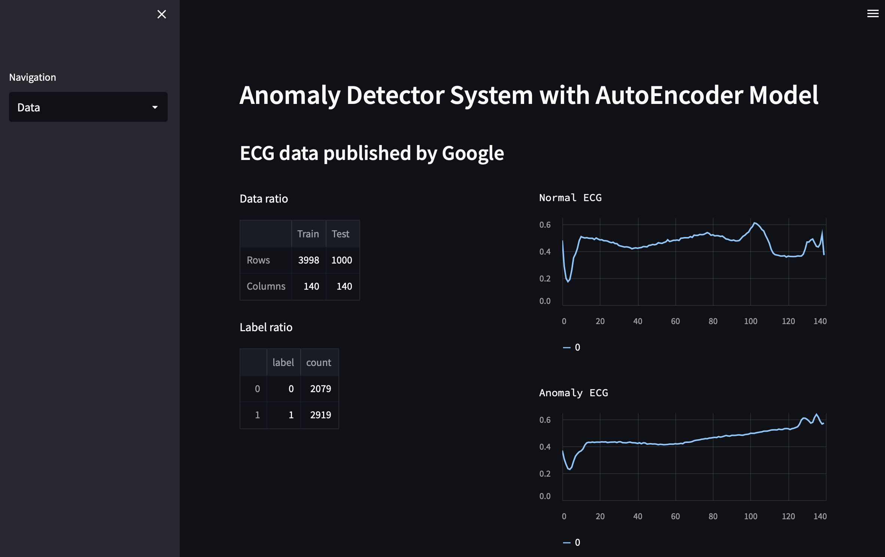
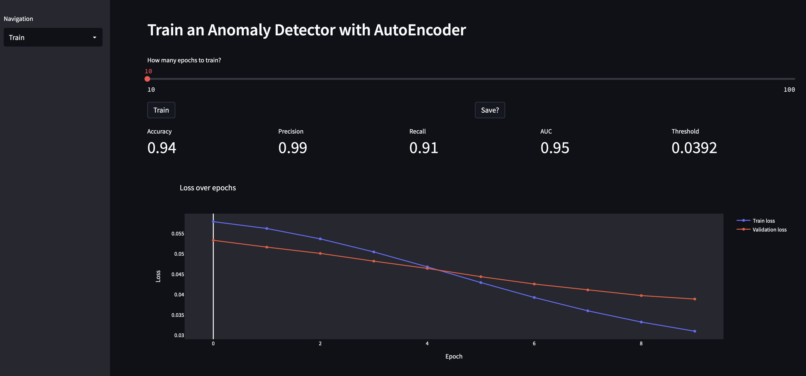
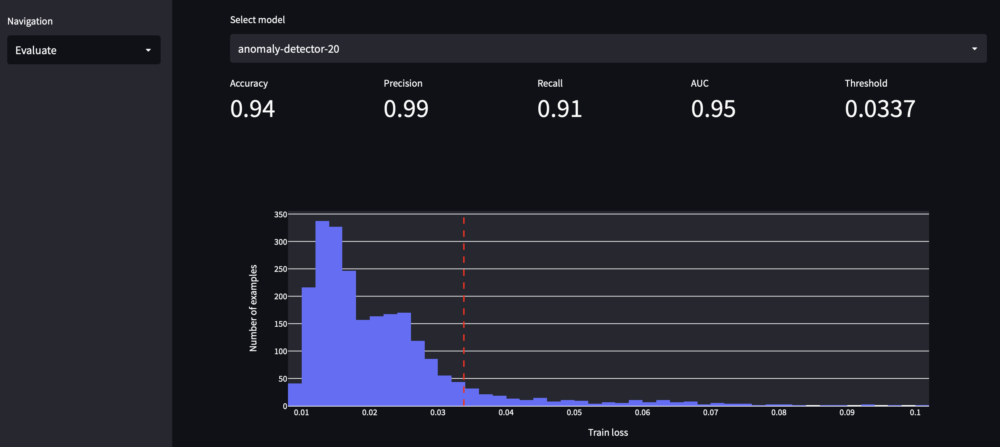
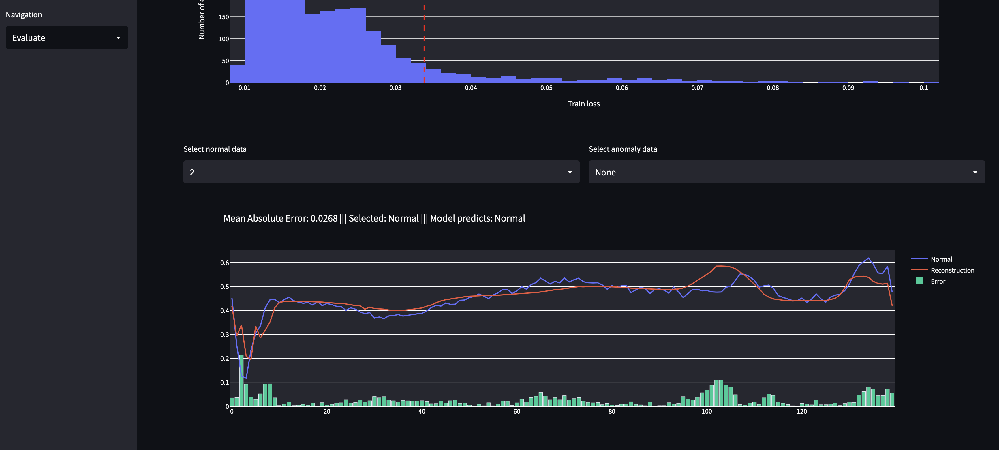

# Anomaly Detector app

## Models
- Deep Convolutional AutoEncoder Neural Network
- Anomaly Detector Dense AutoEncoder Neural Network

## Prerequisite
- install miniforge
- create virtual env
- pip install watchdog matplotlib pandas numpy
- pip install streamlit
- **WINDOWS**
  - conda install -c conda-forge cudatoolkit=11.2 cudnn=8.1.0
  - pip install jupyter matplotlib numpy pandas
  - pip install tensorflow
- **MACOS**
  - pip install jupyter matplotlib numpy pandas
  - tensorflow [installer](https://developer.apple.com/metal/tensorflow-plugin/) for MPS
- run application from terminal:
  - ```streamlit run ./app.py```

# Preview
<br/>
Data page
<br/>


<br/>
Train page
<br/>


<br/>
Evaluate page part 1
<br/>


<br/>
Evaluate page part 2
<br/>
