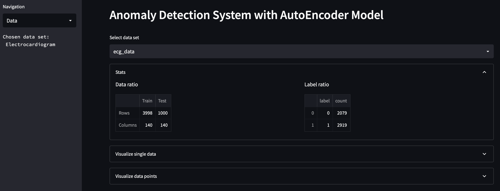
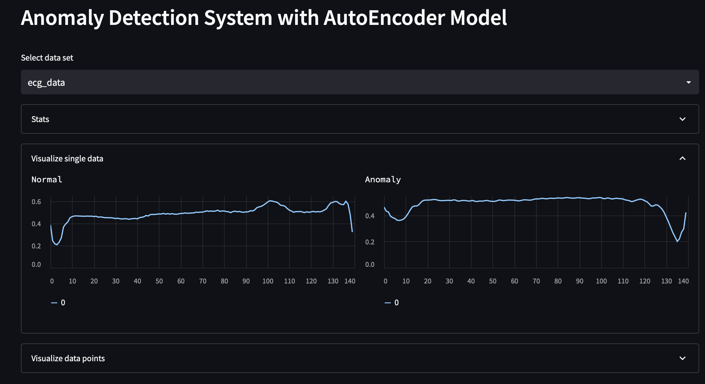
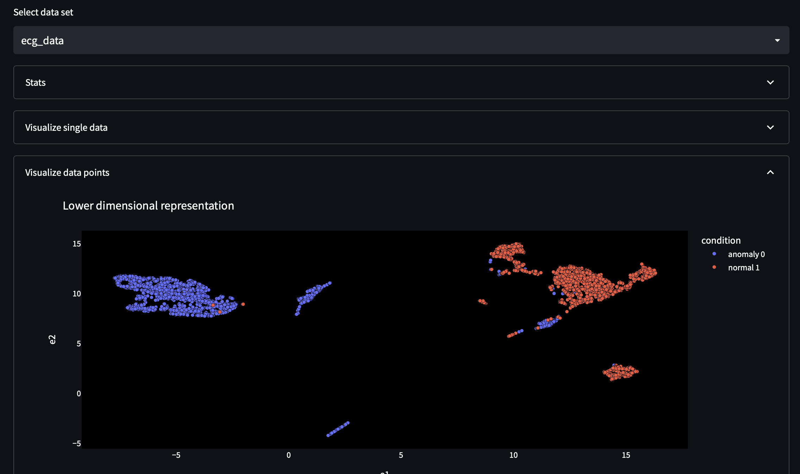
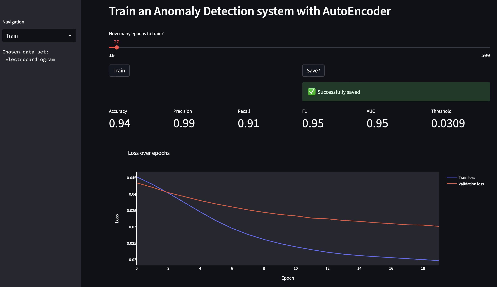
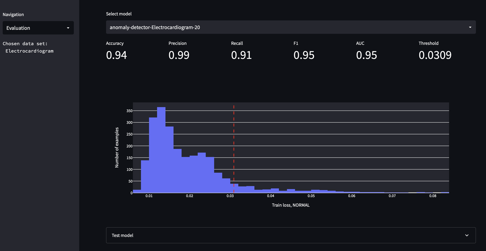
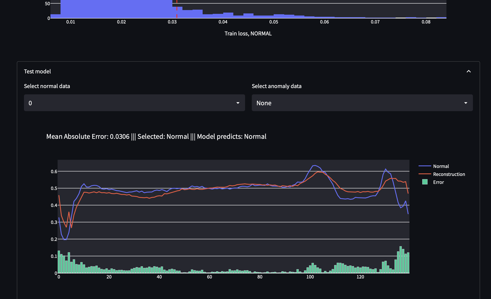

# Anomaly Detection Application

This repo consist of an anomaly detection system (ADS) using AutoEncoder Neural Net developed with Tensorflow and hosted within the framework of Streamlit. ADS has integrated default data sets (Electrocardiogram & Creditcard fraud) that can be utilized for analysis and training purposes.

## Data sets (transformed to Parquet)
- [Electrocardiogram (Google)](https://storage.googleapis.com/download.tensorflow.org/data/ecg.csv)
- [Creditcard fraud (Kaggle)](https://www.kaggle.com/datasets/mlg-ulb/creditcardfraud)

## Models
- [Anomaly Detector Dense AutoEncoder Neural Network](https://github.com/ciCciC/ConvAENN/blob/master/src/nnetwork/anomAeModel.py)

## Prerequisite
- install miniforge
- create virtual env
- from root enter the following command line:
  - ```pip install -r requirements.txt```
- **WINDOWS**
  - ```conda install -c conda-forge cudatoolkit=11.2 cudnn=8.1.0```
  - ```pip install tensorflow```
- **MACOS**
  - tensorflow [installer](https://developer.apple.com/metal/tensorflow-plugin/) for MPS
- run application from terminal:
  - ```streamlit run ./app.py```

# Preview
<br/>
Data page
<br/>




<br/>
Train page
<br/>


<br/>
Evaluate metrics
<br/>


<br/>
Evaluate test model
<br/>
